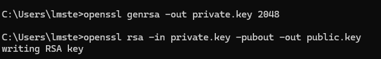

# Week 01 Lab — Key Pair Generation

## Screenshot Evidence

If using OpenSSL:
1. Capture a screenshot showing:
  - The command used to generate the private key
  - The command used to extract the public key
2. Save it as:

**assets/screenshots/week-01/keypair-generation.png**

3. Embed the screenshot below:

****

If using a browser-based generator, capture the generated key pair screen (redact sensitive portions of the private key before committing).

---

## Key Identification
**Which file is the public key?**    
     -public.key: The file you can share.

**Which file is the private key?**    
     -private.key: The file you keep secret.

---

## Key Properties
Briefly describe:
- What makes the public key safe to share  
  -  It only encrypts messages, it cannot decrypt them. Even if someone has it, they can't access the sensitive data and it doesn't reveal any secret information.
- What makes the private key sensitive 
  -  It can decrypt messages encrypted with the public key and anyone with is could access sensitive data meant only for you. It's the secret that proves your identity.

---

## Security Scenario
What would happen if someone obtained your private key?

Explain the risk in terms of:
  - Identity
  - Impersonation
  - Trust
     >Not only can they impersonate you, but they can sign documents in your name and others will think it's you. They will also be able to decrypt anything encrypted to you and you can't deny you signed something (non-repudiation broken).

---

## Observations
Document three observations from this lab.

### Observation 1
  > Private key generation didn't show progress indicators, while the public key extradicition explicitly confirmed "writing RSA key".
### Observation 2
  > OpenSSL doesn't automatically display key contents after generation. You must explicitly view the files. I'm aware this is a security practice so the keys are generated safely without exposing them on screen. While working on a Windows machine, I used Windows-specific commands in OpenSSL (type and dir) to view the keys, as opposed to the Linux equivalents (cat and ls) which I learned in Linux+.

### Observation 3
  > The private key file (1,700 bytes) was significantly larger than the public key file (460 bytes).

---

## Reflection
In 3–5 sentences, explain:

Why must the private key remain secret in a PKI system?

Focus on how identity is tied to possession of the private key.

  > In a PKI system, the private key is the foundation of your digital identity. If someone steals your private key, they can decrypt any messages encrypted to you, sign documents in your name, and create non-repudation issues for you.
