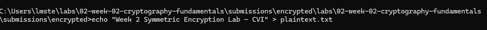
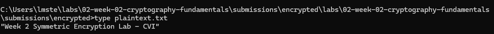
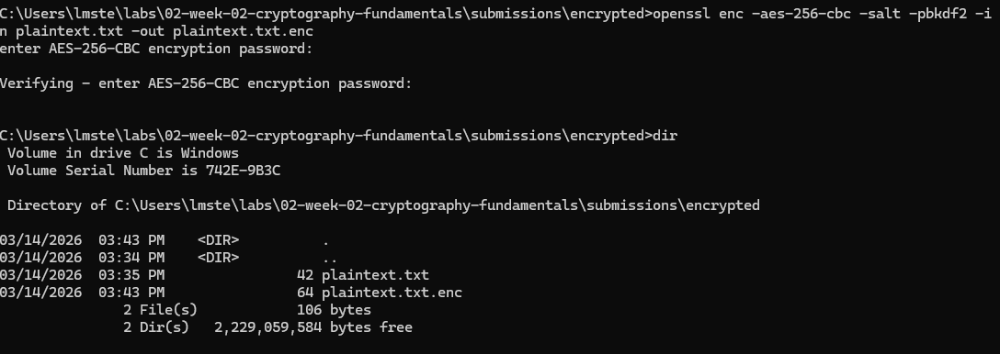
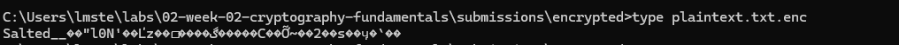
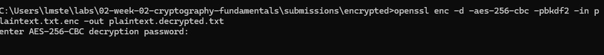
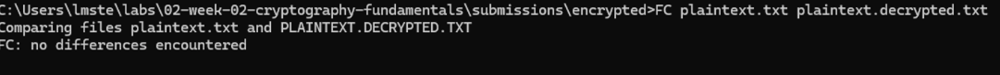

# Lab 1 — Symmetric Encryption
 
## Overview
Briefly describe the purpose of this lab in your own words.
  >The purpose of this lab was to create, encrypt, decrypt and inspect the decrypted file to see if there were any changes.

What PKI concept or system behavior were you investigating?
  >Symmetric Encryption.
 
---
 
## Environment
Document the environment used to complete the lab.
 
- Operating System: Windows
- Terminal Used: Command Prompt (cmd.exe)
- OpenSSL Version (if applicable): OpenSSL 3.6.1 
 
---
 
## Steps Performed
 
*Using commands I:
 
1. Created the labs directory structure for submissions.

2. Created a plaintext file named plaintext.txt containing the text: "Week 2 Symmetric Encryption Lab - CVI".

3. Encrypted the plaintext.txt file with a password, resulting in plaintext.txt.enc.

4. Decrypted plaintext.txt.enc using the same password, producing plaintext.decrypted.txt.

5. Verified that the decrypted file matched the original plaintext file using the diff command, confirming that no changes occurred during encryption and decryption.
 
---
 
## Results

•Created plaintext file
  

•Printed contents of plaintext.txt
  

•Encrypted file created 
  

•Opened the encrypted file 
  

•Decrypted file produced  
  

•Verification 
 
 
---
 
## Key Findings
 
>-Encryption and decryption completed successfully.  
>-File integrity maintained after decryption.  
>-Windows fc command successfully verified equality.  
 
 
---
 
## Explanation  

>The encryption and decryption processes were completed successfully, and verification confirmed that the decrypted file exactly matches the original. This demonstrates the integrity of symmetric encryption and that the data is not altered during the process.
 
---
 
## Challenges / Troubleshooting
 >The lab instructions used diff to compare files, but since I’m on Windows, I used the fc command instead, which successfully verified the files were identical.
 
 
---
 
## Artifacts

plaintext.txt, plaintext.txt.enc, plaintext.decrypted.txt, Step2.png, Step2A.png, Step3.png, Step3A.png, Step4.png, Step5.png
 
---
 
CVI PKI Career Pathway — Foundations Phase
