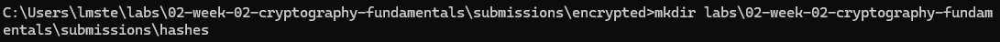
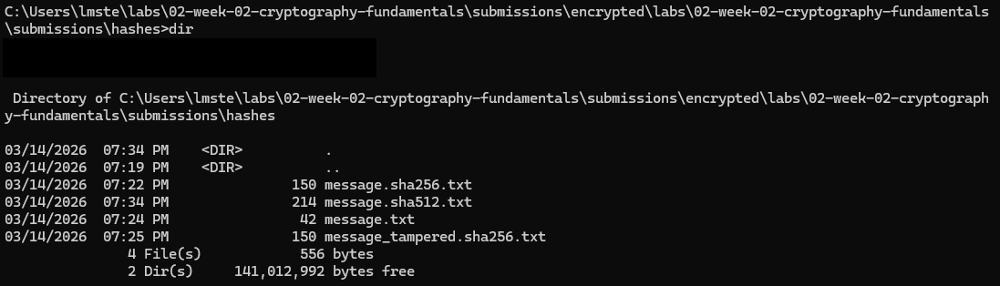
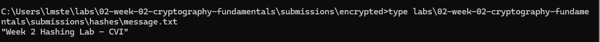
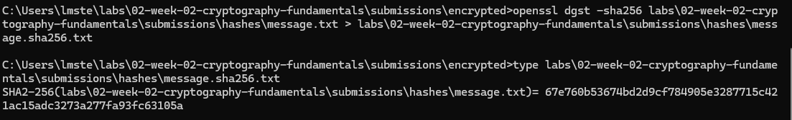
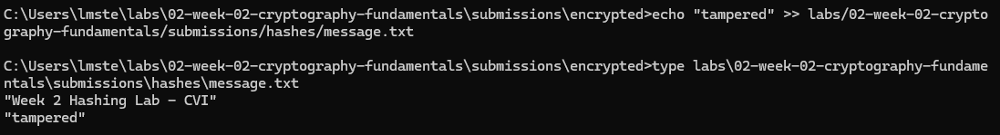
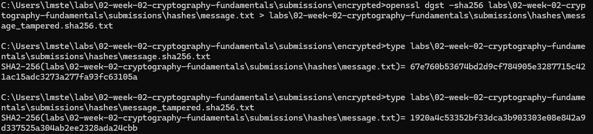

# Lab — Hashing & Integrity

## Overview
Briefly describe the purpose of this lab in your own words.
  >The purpose of this lab was to create a file, generate its SHA-256 hash, modify the file, and then generate a new hash to see how even small changes completely alter the hash. This demonstrates the security property of integrity.

What PKI concept or system behavior were you investigating?
  >Cryptographic hashing and file integrity.
---

## Steps Performed

1. Created a directory to store the lab artifacts.
2. Created a plaintext test file named message.txt with the content: "Week 2 Hashing Lab - CVI".
3. Generated a SHA-256 hash of the file and saved it as message.sha256.txt.
4. Opened the hash file to verify: fixed-length hexadecimal output and algorithm used.
5. Modified message.txt by appending "tampered" to simulate file tampering.
6. Generated a new SHA-256 hash and saved it as message_tampered.sha256.txt.
7. Compared the original and tampered hashes to observe that they are completely different, confirming that even small changes alter the hash.

---

## Results
Include the important outputs or findings from the lab.

Created Artifact Directory

mkdir -p labs/02-week-02-cryptography-fundamentals/submissions/hashes

Folder structure for storing lab files was successfully created.

Verified Directory Structure
echo "Week 2 Hashing Lab - CVI" > labs/02-week-02-cryptography-fundamentals/submissions/hashes/message.txt
Confirmed that the hashes folder exists and is ready for files.

Open the file and confirm it is readable.

Created Test File (message.txt)

The plaintext file was created and contains the expected content: "Week 2 Hashing Lab - CVI".
openssl dgst -sha256 labs/02-week-02-cryptography-fundamentals/submissions/hashes/message.txt > labs/02-week-02-cryptography-fundamentals/submissions/hashes/message.sha256.txt
The SHA-256 hash of the file was generated, showing a fixed-length hexadecimal string.

Open the hash file and observe:
- A fixed-length output
- A hexadecimal string
- The algorithm used (SHA-256)
  

### Step 4 — Modify (Tamper With) the File
echo "tampered" >> labs/02-week-02-cryptography-fundamentals/submissions/hashes/message.txt

Even a single character change is enough.

### Step 5 — Generate a New Hash
openssl dgst -sha256 labs/02-week-02-cryptography-fundamentals/submissions/hashes/message.txt > labs/02-week-02-cryptography-fundamentals/submissions/hashes/message_tampered.sha256.txt

Compare the two hash outputs of message.sha256.txt and message_tampered.sha256.txt

They should be completely different.

## Part 3 — Observations
Document the following in your Week 2 notes:
- Why the hash changed after a small modification
- Why hashing does NOT provide confidentiality
- What security property hashing provides
- Where hashing is used in PKI systems

Examples to consider:
- Certificate signatures
- File integrity validation
- Code signing

### Submission (Portfolio Repo)
Ensure the following files exist:

labs/02-week-02-cryptography-fundamentals/submissions/hashes/
  message.txt
  message.sha256.txt
  message_tampered.sha256.txt

Commit and push your changes.

Do not upload screenshots unless explicitly requested.

## Stretch (Optional)
Try using a different hashing algorithm:

openssl dgst -sha512 message.txt

- How does the output length compare?
  >SHA-512 makes a longer hash than SHA-256. SHA-256 gives 64 hex characters, and SHA-512 gives 128. So the SHA-512 hash is bigger and harder to mess with.
  
- Why are weak hashing algorithms (like SHA-1) no longer recommended?
  >Weak hashes like SHA-1 aren’t safe anymore because people can figure out collisions — two different files could have the same hash. That makes them easy to break, so we use stronger ones like SHA-256 or SHA-512.  

CVI PKI Career Pathway — Foundations Phase

