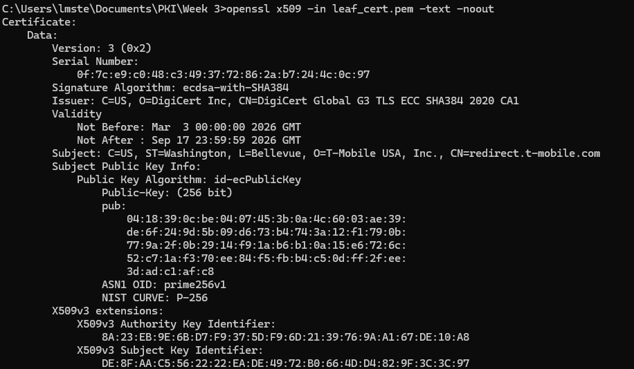
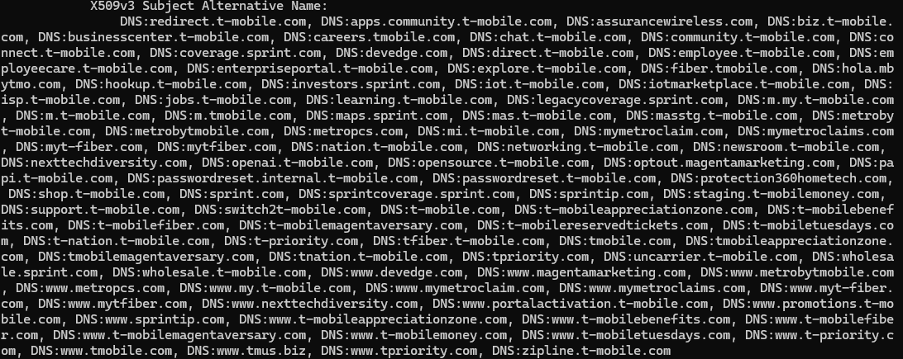

# Lab 02 — Investigate Certificate Extensions

## Overview
Briefly describe what this lab was about in your own words.
  >This lab was about pulling and inspecting the X.509 extension fields and understanding how to find and interpret what each section is used for in a certificate.

What PKI concept were you investigating?
  >Certificate extensions, what they are, and how they control how a certificate is used and validated in TLS.

---

## Environment
- OS: Windows
- Terminal used (Mac Terminal / Git Bash / WSL): Command Prompt(cmd.exe)
- OpenSSL version (`openssl version`): OpenSSL 3.6.1 

---
## Steps Performed
Summarize the key steps you performed to complete the lab.

Do **not copy the lab instructions**.
Describe what you actually did.

1. Ran the command `openssl x509 -in leaf_cert.pem -text -noout` on the PEM file from Lab 1 to examine the certificate contents.
2. Reviewed the SANs to verify which domains the certificate covered.  
3. Checked the Key Usage field to note purposes such as digital signature and key agreement.  
4. Examined the Extended Key Usage to confirm TLS Web Server Authentication.  
5. Verified the Basic Constraints, which was set to false.  
6. Reviewed all fields to understand how each could affect certificate validation.

---
## Results
Include the important outputs or findings from the lab.

>Ran inspection command  
  

>SAN Output  
  

>Key Usage  
  

>Extended Key Usage  
  

>Basic Constraints  
  
---

## Key Findings
Document the most important observations from the lab.

- The certificate includes multiple domains and subdomains, verified through the SANs.  
- The Extended Key Usage (EKU) is set for TLS Web Server Authentication.  
- The Key Usage field allows digital signatures and key agreement.  
- The Signature Algorithm is ecdsa-with-SHA384. 

---

## Explanation
Explain **why the results matter**.

>These results matter because they show whether the certificate is valid and what it is authorized to do. Each field—Key Usage, Extended Key Usage, SANs, and signature algorithm—must align correctly, or the certificate will fail validation. In a real-world PKI environment, a misconfigured or missing field can prevent secure connections, such as HTTPS authentication, from working correctly. This lab demonstrates how proper certificate configuration ensures trusted communication.

---

## Challenges / Troubleshooting
>I did not encounter any significant issues while completing this lab. Because I am working in a Windows environment, I had to adjust some of the OpenSSL commands to ensure they executed correctly.

---

## Artifacts
-leaf_cert.pem  
-lab-02-certificate-extensions.md    
-Screenshots stored in `assets/screenshots/`: 
  -W3L1.png, W3L2.png, W3L3.png, W3L4.png, W3L11.png 

Examples:

- Any `.pem`, `.crt`, or `.key` files produced
- Your completed lab write-up `.md` file
- Screenshots stored in `assets/screenshots/`

---
## Extensions Found

### Subject Alternative Name (SAN)
Paste the value from your output:
  >`DNS:www.t-mobile.com, DNS:b2b.t-mobile.com, DNS:t-mobile.com`

### Key Usage
Paste the value from your output:
  >Critical: Digital Signature, Key Encipherment

### Extended Key Usage (EKU)
Paste the value from your output:
   >TLS Web Server Authentication, TLS Web Client Authentication 

### Basic Constraints
Paste the value from your output:
  > critical CA:FALSE
              
---

## Observations

1. What domains appear in the SAN field?  
> `DNS:www.t-mobile.com, DNS:b2b.t-mobile.com, DNS:t-mobile.com`

2. What is this certificate authorized to do based on Key Usage?  
> It used for digital signatures and key encipherment.

3. What does the EKU field tell you about this certificate's purpose?  
> It tells us the certificate is specifically used for TLS web server and client authentication.

4. Is this a CA certificate? How can you tell?  
> No, because it says CA:FALSE, which means it cannot sign other certificates.

5. Why does SAN matter more than the Subject CN field in modern TLS?  
> Modern TLS uses the SAN field to verify domain names, and the CN is no longer relied on for that. The SAN field can list multiple domains and subdomains, while the CN only supports one, which makes it more limited. Because of that, SAN became the standard for hostname validation.
> 
---

## Artifacts
- leaf_cert.pem, W3L1.png, W3L2.png, W3L3.png, W3L4.png, W3L11.png,  
