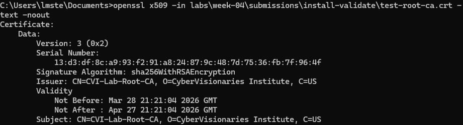
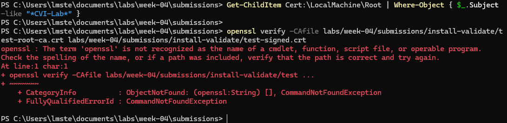
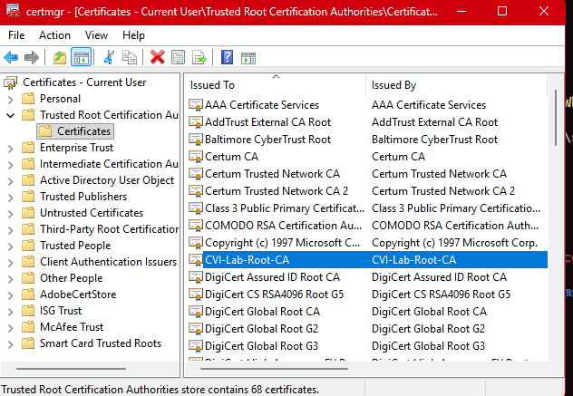
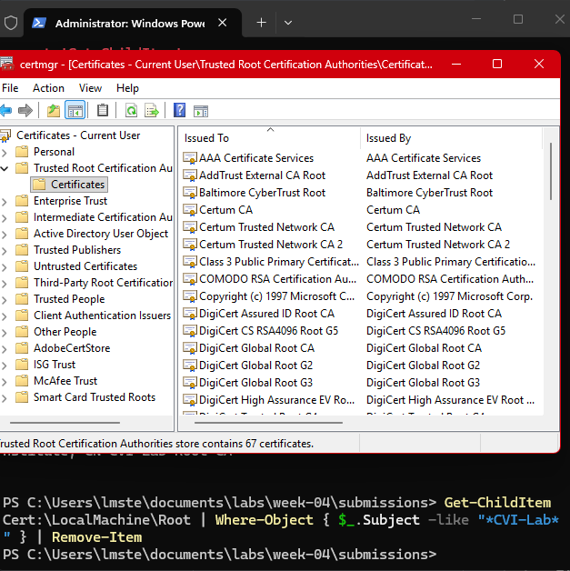

# Lab 03 — Install a Certificate and Validate Trust (Stretch)

## Overview
Briefly describe what this lab was about in your own words. What PKI concept or system behavior were you investigating?
  >In this lab, I worked through the full certificate process in a PKI setup. I created a self-signed root CA, added it to my Windows trust store, then made a certificate signed by that CA. I checked that the signed certificate properly chained back to the root, and finally removed the test CA to see how it affected trust validation. The goal was to get hands-on with certificate trust, how chains work, and what happens when a root CA is added or removed.

## Environment
- Operating System: Windows
- Terminal Used: cmd.exe, PowerShell
- OpenSSL Version (openssl version): OpenSSL 3.6.1 

## Steps Performed
  >1. Created a directory to store the lab artifacts.
  >2. Generated a self-signed root CA and installed it into the Windows trust store.
  >3. Created a certificate signed by that root CA.
  >4. Verified that the signed certificate chained correctly to the root CA.
  >5. Removed the test root CA and observed that trust validation for the signed certificate failed, confirming the removal effect.

## Results
- What did the certificate output show when you verified test-root-ca.crt?  
  >The certificate details including, the subject, issuer, validity period
  
  
- What did the verify output return after signing — before and after cleanup?
  >Before Cleanup labs/week-04/submissions/install-validate/test-signed.crt: OK: 
  
  >
  
  >After Cleanup: Cert was gone from the Windows trust store and no longer appeared in certmgr.
  
  
- What confirmed the trust chain was established?
  >The trust chain was established when openssl verify -CAfile test-root-ca.crt test-signed.crt returned OK. This confirmed that the signed certificate's issuer matched the test root CA, and the chain validated successfully from the signed cert back to the trusted root.

  
## Key Findings

  >The test root CA was self-signed because the Issuer and Subject were the same — both said CN=CVI-Lab-Root-CA, O=CyberVisionaries Institute, C=US. That's what makes it self-signed.

  >After I installed the root CA into my Windows trust store, certificates signed by it became trusted. When I ran the verify command, it returned OK, which meant the trust chain worked and the signed certificate validated back to the root.

  >When I removed the root CA from the Windows trust store, it disappeared from certmgr completely. That showed me that deleting the root CA immediately breaks the trust for any certificates it signed.  

  >The whole trust chain depends on the root CA being in the system's trust store. If the root is gone, the signed certificate can't validate because there's nothing to trust it back to.

## Explanation
- What made the test root CA self-signed? How did you identify that in the output?
  >A certificate is self-signed when the Issuer and Subject are the same. In my test root CA output, the Issuer and Subject both say CN=CVI-Lab-Root-CA, O=CyberVisionaries Institute, C=US, which means the certificate signed itself. That's how I identified it as self-signed — the certificate authority that issued it is the same as the certificate itself.
  
- What changed on your system after you installed the root CA?
  >Before I installed the root CA, my system didn't trust certificates signed by it. After I imported the root CA into the Windows trust store using PowerShell and OpenSSL, my system started trusting it. Then when I ran openssl verify -CAfile test-root-ca.crt test-signed.crt, it returned OK, which meant the verification worked.
  
- In an enterprise environment, who controls what root CAs are installed on employee machines?
   >The admin team controls what root CAs are installed on employee machines using Group Policy Objects (GPO). This is way more effective than manually installing certificates on every machine — with GPO, the admin can push a root CA to hundreds or thousands of machines at once. Doing it manually would be impractical and time-consuming.
     
- Why is it a security concern if an attacker can install a root CA on a device?
  >If an attacker can install a root CA on my device, they can create and sign certificates that my system will trust. This means they can impersonate legitimate websites or services, intercept my traffic, and decrypt sensitive information without me knowing. They basically have the same power as a real CA, which breaks the entire trust chain.

## Challenges / Troubleshooting

  >1.OpenSSL not recognized in PowerShell:  
I kept getting the error "The term 'openssl' is not recognized" when I tried to run OpenSSL commands in PowerShell. OpenSSL wasn't in the system PATH for PowerShell, even though I was running as admin. I fixed this by switching to Command Prompt, where OpenSSL was already configured and working.

  >2.Multi-line command issue:  
When I tried to split an OpenSSL command across multiple lines in PowerShell using backslashes, it failed because PowerShell doesn't handle line continuation the same way. I had to run the full command on one line in Command Prompt instead.

## Artifacts
- test-root-ca.crt, test-signed.crt, test-signed.csr
