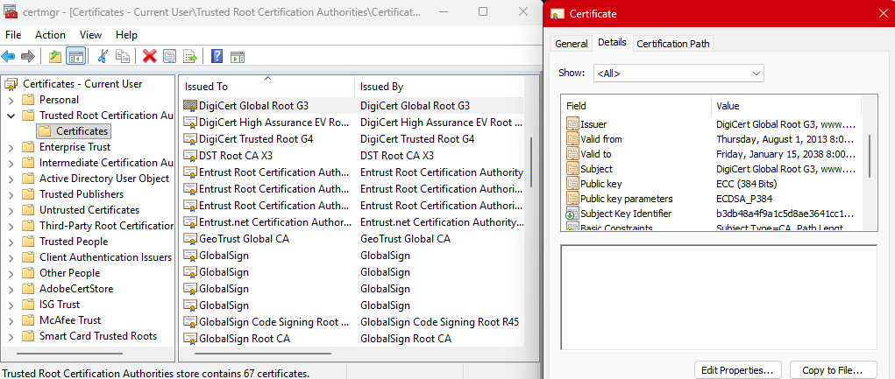
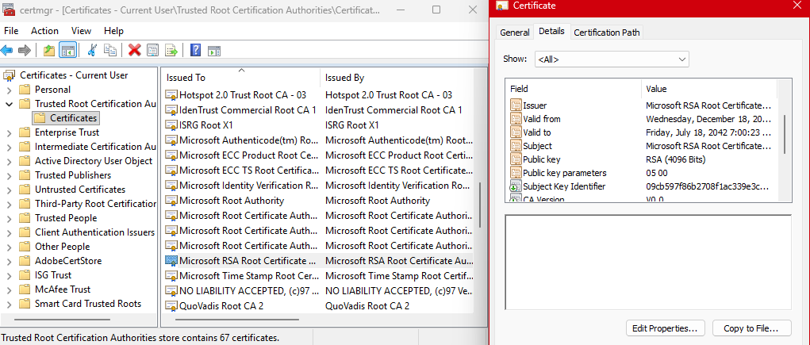
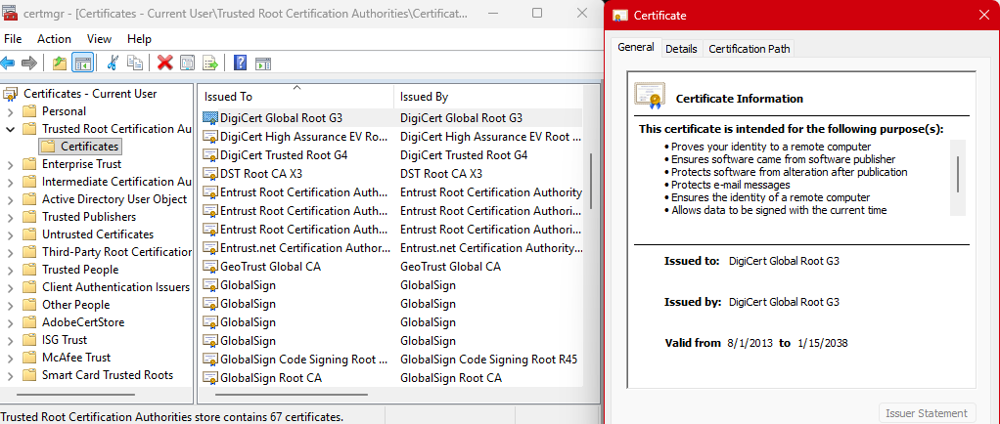
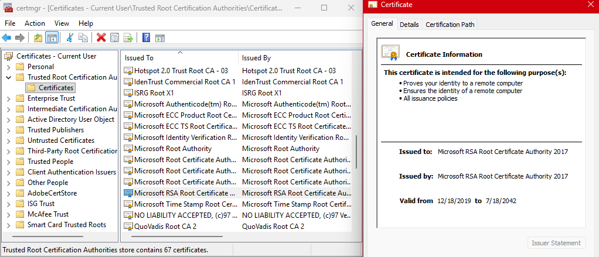

# Lab 02 — Inspect Your Trust Store

## Overview
Briefly describe what this lab was about in your own words. What PKI concept or system behavior were you investigating?
  >This lab explored the trusted root certificate store for my user session. I checked the listed certificates, their details, and compared familiar vs. unfamiliar root CAs to see their purposes and how expired certificates still appear.

## Environment
- Operating System: Windows
- Terminal Used: cmd, PowerShell
- OpenSSL Version (openssl version): OpenSSL 3.6.1 

## Steps Performed
### To view and retrieve certification details:
  >1. Went to certmgr on my local machine > Trusted Root Certification Authorities > Certificates.
  >2. Viewed the details of the certificates I chose to examine (DigiCert Global Root G3 and Microsoft RSA Root Certificate Authority 2017) using the Details, General, and Certification Path tabs.

### To verify root certificates for Google:
  >1. Ran `openssl s_client -connect google.com:443 -verify_return_error` and received verify error:num=20:unable to get local issuer certificate.
  >2. Downloaded the root and intermediate certificate bundle for GlobalSign Root CA, saved it as bundle.pem on my machine.
  >3. Ran `openssl s_client -connect google.com:443 -CAfile bundle.pem -verify_return_error` and received Verify return code: 0 (ok).

## Results
- How many trusted root CAs did you find on your system?
  >67
- Name at least one specific root CA you inspected. Include its Subject and expiration date.
  
  > **DigiCert Global Root G3**  
  > **Subject:** DigiCert Global Root G3  
  > **Issuer:** DigiCert Global Root G3  
  > **Valid From / Valid To:** ‎Thursday, ‎August ‎1, ‎2013 8:00:00 AM until Thursday, ‎Friday, ‎January ‎15, ‎2038 8:00:00 AM
  > **Public Key Algorithm:** ECC (384 bits)

  > **Microsoft RSA Root Certificate Authority 2017**  
  > **Subject:** Microsoft RSA Root Certificate Authority 2017  
  > **Issuer:** Microsoft RSA Root Certificate Authority 2017  
  > **Valid From / Valid To:** Wednesday, December 18, 2019 6:51:22 PM until Friday, July 18, 2042 7:00:23 PM  
  > **Public Key Algorithm:** RSA (4096 bits)

  
- What did the verify return code output tell you?
 >When I ran openssl s_client -connect google.com:443 -verify_return_error, it returned code 20 because OpenSSL could not validate the certificate chain. This happened because OpenSSL does not automatically use the Windows trust store, and it also did not have access to the full certificate chain. After downloading the root and intermediate certificates and providing them with the -CAfile option, the verification succeeded and returned code 0.
 

## Key Findings

> Some certificates are expired but still show up in the store. For example, the certificate status for Microsoft Root Authority 2017 says "This certificate has expired or is not yet valid."

> OpenSSL doesn't automatically use the Windows trust store. It has its own separate trust store, which is why I had to explicitly pass the certificate files using the -CAfile switch to validate the chain.

> My research confirmed that DigiCert is a larger, more general CA with more purposes, while Microsoft Root Authority 2017 is specifically for Microsoft's ecosystem and mainly trusted on Windows systems.

> The DigiCert certificate has more intended purposes, like verifying software and email, while Microsoft Root Authority 2017 is simpler. This shows that different root CAs have different roles.  

## Explanation
- Why does your browser trust a certificate from a website you have never visited before?
    >Because the root CA that issued the certificate is already installed in my machine's trust store. My browser validates the certificate chain up to that root CA, and if it's valid, it trusts the certificate — even for sites I've never visited.
    
- What would happen if an enterprise's internal root CA was NOT in the trust store?
  >The certificate chain would break, and users would receive security warnings because the internal CA isn't trusted. Even if the certificate is technically valid, the system won't recognize it.
  
- What surprised you about how many roots are pre-installed on your system?
  >I was surprised by how many root CAs come pre-installed. I didn't expect a single machine to have that many trusted roots already built in.

## Challenges / Troubleshooting

**1. OpenSSL certificate validation error**

While running `openssl s_client -connect google.com:443 -verify_return_error`, I got "verify error:num=20:unable to get local issuer certificate". This error meant OpenSSL couldn't find the root CA in its own trust store (OpenSSL doesn't automatically use Windows certificates).

I first tried exporting the GlobalSign Root CA from certlm and importing it into Trusted Root Certification Authorities in certmgr, but running the command again still gave me code 20.

Next, I converted the certificate from DER to PEM format using `openssl x509 -inform DER -in GlobalSignRoot.cer -out GlobalSignRoot.pem`. 

I remembered from feedback from a previous lab that when a certificate is missing, to "pass the file" using a switch. So I decided to try using the -CAfile switch to point OpenSSL to the certificate file directly.
I ran `openssl s_client -connect google.com:443 -CAfile GlobalSignRoot.pem -verify_return_error`. At first I thought it failed because there were error messages at the end of the output. But after looking at it more carefully, I realized it actually returned Verify return code: 0 (ok). Those messages were just about how the connection closed, not the certificate verification itself.

To ensure the full chain was verified, I also downloaded the root and intermediate certificate bundle from the GlobalSign support page, saved it as bundle.pem, and ran: `openssl s_client -connect google.com:443 -CAfile bundle.pem -verify_return_error`. That also returned code 0.

I learned that OpenSSL needs certificates in PEM format and you gotta read the output carefully — not all "errors" mean verification failed. Using the -CAfile switch with either the single certificate or the full bundle made the verification succeed.

**2. Print Screen didn't work in Certificate Manager**

When I tried to screenshot the certificate details, Print Screen didn't work. I found out Windows blocks screenshots in secure areas like certmgr, so I used Windows + Shift + S instead.

## Artifacts
- bundle.pem, GlobalSignRoot.cer, GlobalSignRoot.pem, W4Lab2A.png, W4Lab2B.png, W4Lab2C.png, W4Lab2D.png
