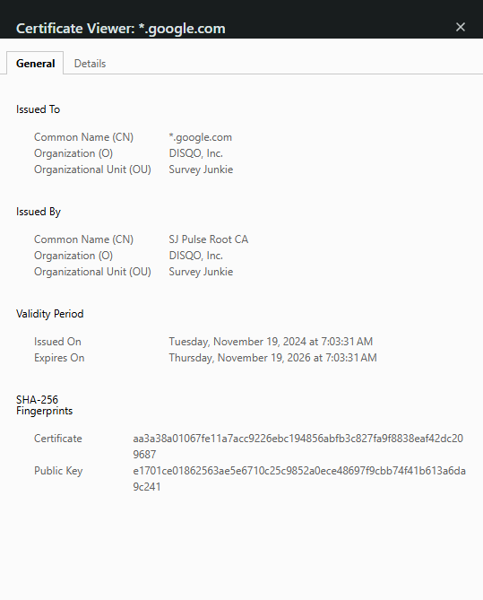

# Week 01 Mini Lab — Trust Chain Validation

## Screenshot Evidence

Capture a screenshot of the Certification Path (certificate chain) from your browser.

Save it as:

assets/screenshots/week-01/trust-chain-validation.png

Embed the screenshot below:

## Website Information

**Website inspected:**  
(https://www.google.com/)

---

## Certificate Chain Breakdown

**Leaf (Server) Certificate**  
*.google.com

**Intermediate Certificate Authority**
GTS WR2

**Root Certificate Authority (Trust Anchor)**
GTS Root R1

---

## Trust Anchor Verification

Is the Root CA marked as trusted by your system?

Yes.

If yes, explain where that trust comes from (OS/browser root store).
GTS Root R1 is trsuted by my stsem because it is listed in my browser's root certificate store.

If no, explain what warning or behavior occurred.

---

## Observations

Document three observations about the certificate.

### Observation 1
The certificate structure is hierarchical with three levels: the root CA (GTS Root R1) at the top, the intermediate CA (GTS WR2) in the middle, and the server certificate (*.google.com) at the bottom. 
In Firefox, these certificates are displayed as seperate tabs rather than a visual tree diagram, but they still form the same chain of trust where each certficiate is issued by the one above it. 

### Observation 2
The root CA is self-signed, meaning it issues itself. It's the foundation of trust and pre-installed in the browser's root certificate store. Unlike the other certificates, it doesn't need to be verified by another authority becasue it's the top-level authority.

### Observation 3
The browser determines trust by checking if the root CA is in its pre-installed root certificate store. If it finds the root CA there, it automatically trusts the entire chain below it. If the root CA isn't trusted, the browser shows a security warning.

---

## Reflection

In 3–5 sentences, explain:

The root certificate is called the trust anchor because it's the foundation of trust. 
Validation starts at the root and if it checks out, then it checks the intermediary, and then the server certificate.
If the Root CA wasn't trusted the webpage would be inaccessible because the chain of trust would be broken and a security warning would be issued.

