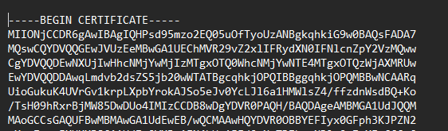
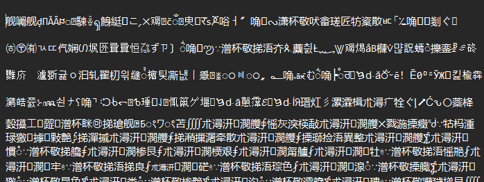
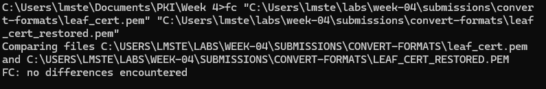
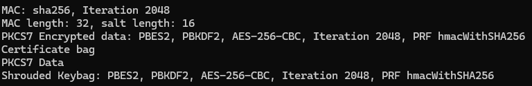

# Lab 01 — Convert Certificate Formats

## Overview
Briefly describe what this lab was about in your own words. What PKI concept or system behavior were you investigating?
  >This lab focused on converting certificates between PEM, DER, and PFX formats and seeing how each one behaves. I worked through creating, converting, and verifying certificates to understand how encoding formats affect readability and how certificates and private keys are stored and transferred in a PKI environment.

## Environment
- Operating System: Windows  
- Terminal Used: Command Prompt (cmd.exe)
- OpenSSL Version (openssl version): OpenSSL 3.6.1 

## Steps Performed
Summarize the key steps you performed. Do not copy the lab instructions — describe what you actually did.

1. Created the `leaf_cert.pem` file using OpenSSL.
2. Converted `leaf_cert.pem` to DER format (`leaf_cert.der`) using OpenSSL.
3. Verified the PEM and DER versions using `openssl x509 -text -noout` to inspect certificate details.
4. Converted the DER file back to PEM format (`leaf_cert_restored.pem`) to ensure integrity.
5. Used the Windows `fc` command to compare the original PEM file and the restored PEM file.
6. Generated a new RSA private key (`test_key.pem`) for lab testing.
7. Created a self-signed certificate (`test_cert.pem`) using the newly generated private key.
8. Bundled the test certificate and private key into a PFX file (`test_bundle.pfx`) with a password using OpenSSL.
9. Verified the contents of the PFX file with `openssl pkcs12 -info -noout`, confirming the presence of the certificate and encrypted private key.

## Results
- What did the PEM file look like compared to the DER file?
  >The PEM file was readable. It began with `-----BEGIN CERTIFICATE-----` and ended with `-----END CERTIFICATE-----`.    

  
- What happened when you opened the .der file in a text editor?  
  >The DER file was not human-readable and appeared as binary/garbled characters.   

 
- What did the diff output show after converting PEM → DER → PEM?    
  >FC: no differences encountered.  

  
- What information was displayed when you verified the PFX?  
  >This output shows the encrypted private key (Shrouded Keybag) and certificate information. The actual private key is not displayed.  

## Key Findings

1. Converting PEM → DER → PEM didn’t change the certificate at all. I checked with the `fc` command, and the restored PEM matched the original perfectly.  

2. DER is a binary encoding format for X.509 certificates and is not human-readable. It is used in systems and protocols that require compact binary representation, including Java-based applications and embedded environments.

3. The PFX file contains both the certificate and the private key. The password keeps the key safe, so no one can grab it if the file is sent somewhere.  

4. Each format has its purpose: PEM is human-readable and commonly used in configuration files, DER is a binary format used when applications require non-text encoded certificates, and PFX is used to securely bundle and transfer a certificate with its private key.

## Explanation

- Why does a PFX require a password?  
  > A PFX requires a password because it contains the private key. The password ensures confidentiality and prevents unauthorized access if the file is transmitted or stored.

- In what real-world scenario would you choose PEM vs DER vs PFX?  
  > Use PEM for human-readable certificates, such as configuration files or Linux servers. Use DER for binary format requirements, such as Java applications, embedded systems, or network devices that require strict binary encoding. Use PFX when you need to bundle the certificate and private key together, for example, when importing into Windows or a browser.

- Why is it important never to commit private key files to GitHub?  
  >Because exposing a private key allows an attacker to impersonate the certificate owner, decrypt sensitive communications, or perform man-in-the-middle attacks. Once a private key is compromised, the certificate can no longer be trusted.

## Challenges / Troubleshooting

- The OpenSSL commands themselves ran smoothly, but I had to adapt them to Windows syntax and paths, which took some trial and error.  

- Moving the `.pem` file into the correct directory was tricky at first. I had to make sure Command Prompt could locate the file before running any conversion commands.  

- Handling folder paths with spaces required using quotes around the paths to avoid errors.  

- Overall, the main challenge was making sure the files were in the right place and the commands were correctly formatted for Windows, rather than the certificate conversions themselves.

## Artifacts
- leaf_cert.pem, leaf_cert.der, leaf_cert_restored.pem, test_cert.pem, test_bundle.pfx
