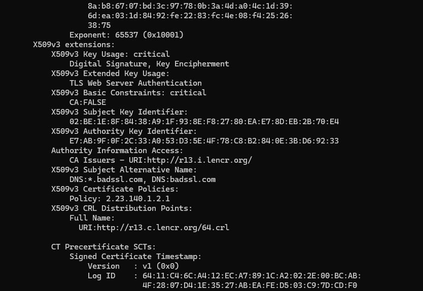
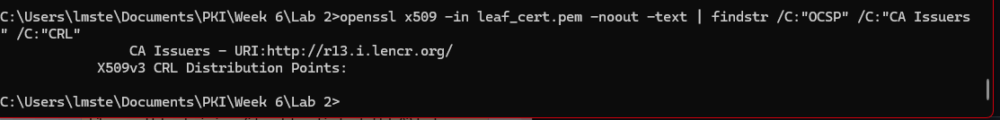

# Lab 02 — Diagnose a Broken Certificate Chain

## Incident Summary

**Target System:** Radiology imaging platform (simulated via incomplete-chain.badssl.com)

**Reported Behavior:** TLS failure after certificate renewal — vendor says certificate looks fine, connection still failing

**Diagnostic Scope:** PKI Diagnostic Framework — all 4 steps

## Diagnostic Steps

Summarize what you checked at each step. Do not copy the lab instructions — describe what you actually did.

**Step 1 — Retrieve:** 
  >Ran command to retrieve the full chain: `openssl s_client -connect incomplete-chain.badssl.com:443 -showcerts` then copied the leaf certificate into a file and saved it as leaf_cert.pem.

**Step 2 — Parse:**
  >Ran command `openssl x509 -in leaf_cert.pem -text -noout` to parse and display the certificate details.

**Step 3 — Validate the Chain:**
  >Ran openssl verify leaf_cert.pem and got error 20 indicating the intermediate certificate was missing. Downloaded the R13 intermediate using curl -o intermediate.der http://r13.i.lencr.org/. Converted it to PEM format using openssl x509 -inform DER -in intermediate.der -out issuer_cert.pem. Re-ran openssl verify -untrusted issuer_cert.pem leaf_cert.pem, which still failed to validate the full chain in my environment. After correcting the OpenSSL trust configuration using the Git Bash CA bundle, the certificate chain successfully validated and returned leaf_cert.pem: OK.

**Step 4 — Check Revocation and Trust:**
  >I checked the certificate for revocation information using `openssl x509 -in leaf_cert.pem -text -noout | findstr OCSP`.

  >The certificate does not include an OCSP responder URL, but does include a CA Issuers URL and a CRL distribution point. This confirms revocation is handled via CRL rather than OCSP for this certificate

  

## Evidence

- Leaf certificate Subject: *.badssl.com 
- Issuer CN (the missing intermediate): R13
- Number of certificates the server sent: 1
- Verify return code from openssl s_client: 21
- openssl verify error before adding intermediate: error 20 at 0 depth lookup: unable to get local issuer certificate
- openssl verify result after adding intermediate with -untrusted: leaf_cert.pem: OK  
- Is the root CA trusted by your system? (yes/no): Yes — the root CA is present in the system trust store, but the certificate chain could not be validated due to a missing intermediate certificate.

## Root Cause

Is this a certificate problem or a server configuration problem? Explain the distinction clearly — this matters for how the fix is communicated to the team.
  >The root cause is a server configuration issue because the server fails to include the intermediate certificate in the TLS handshake. As a result, clients cannot build a complete chain of trust from the leaf certificate to a trusted root CA.

## Remediation

Step-by-step path to resolve this incident:

1. Download the missing intermediate certificate from the CA using: `curl -o intermediate.der http://r13.i.lencr.org/`
2. Convert the downloaded certificate into PEM format to ensure it could be used by OpenSSL: `openssl x509 -inform der -in intermediate.der -out issuer_cert.pem`  
3. Verify the certificate chain locally by supplying the intermediate certificate manually: `openssl verify -untrusted issuer_cert.pem leaf_cert.pem`

## Key Findings

  >During analysis, I found that the certificate only included a CA Issuers link (http://r13.i.lencr.org/), but did not include an OCSP responder URL. However, this was not related to the failure.

  >The real issue was that the server only provided the leaf certificate during the TLS handshake and did not include the intermediate certificate needed to build a complete trust chain. Because of this, clients were unable to validate the certificate even though the certificate itself was valid and within its validity period.

## Challenges / Troubleshooting

  >The main difficulty was confirming that the failure was caused specifically by the missing intermediate certificate rather than something like OCSP or system trust issues. On Windows, I also ran into issues using OpenSSL paths meant for Linux, which made some verification steps confusing at first.

  >Once I focused on the chain output from openssl s_client, it became clear that only the leaf certificate was being served, which confirmed the root cause.

  >I became confused from mixing s_client handshake errors with verify validation errors. I initially treated them as separate problems, but both were pointing to the same underlying issue: an incomplete certificate chain due to a missing intermediate.

  >Step 3 gave me more trouble than expected. Even after supplying the intermediate with -untrusted, the verify still failed because OpenSSL couldn't locate the Let's Encrypt root in my local Windows trust store. I had to point it to the Git Bash CA bundle using -CAfile to get leaf_cert.pem: OK. The missing intermediate was still the root cause — this was just an environment issue on my end.

  >For Step 4, I also spent time trying to confirm whether an OCSP responder URL was present in the certificate. I ran openssl x509 -in leaf_cert.pem -noout -text | findstr /C:"OCSP" /C:"CA Issuers" /C:"CRL" to isolate the relevant fields. The output only returned the CA Issuers URL and a CRL distribution point — no OCSP URL appeared. I checked both the leaf and the intermediate to make sure I wasn't missing it, but confirmed it genuinely isn't present in this certificate. The certificate includes a CA Issuers URL and a CRL distribution point, but does not include an OCSP responder URL. However, revocation mechanisms were not involved in the failure.

## Artifacts

- leaf_cert.pem, issuer_cert.pem, Wk6Lab2.png, Wk6Lab2A.png
