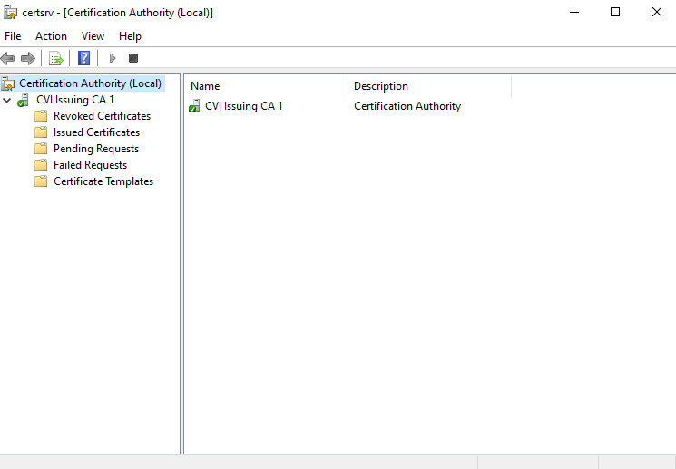

# Lab 01 — Environment Verification & VM Connectivity Check

Lufann Stewart  
May 6, 2026  
**Phase:** 2 | **Week:** 9  
**Submission Path:** labs/week-09/lab-01-environment-verification.md

---

## Step 1 — VM Startup & Login

VMs started in correct order (DC01 → PKI-SRV01):    
   >Yes

Login credentials table:

| VM         | Account Used        | Login Successful? |
|------------|---------------------|:-----------------:|
| DC01       | CORP\pki.admin      |       Yes         |
| PKI-SRV01  | CORP\pki.admin      |       Yes         |
| Root-CA    | .\Administrator     |       Yes         |

Notes / issues encountered:
   >No issues were encountered during setup or login. Successfully authenticated into the VM environment and verified connectivity and system access.

---

## Step 2 — VM Connectivity Test

Command: `Test-Connection -ComputerName DC01 -Count 2`

Output:
```
Source        Destination     IPV4Address      IPV6Address                              Bytes    Time(ms) 
------        -----------     -----------      -----------                              -----    -------- 
PKI-SRV01     DC01            192.168.10.10                                             32       1        
PKI-SRV01     DC01            192.168.10.10                                             32       1        
```

DC01 responded successfully: 
   >Yes

---

## Step 3 — CertSvc Service Status

Command: `Get-Service -Name CertSvc`

Output:
```
Status   Name               DisplayName                           
------   ----               -----------                           
Running  CertSvc            Active Directory Certificate Services 
```

Status confirmed as Running:    
   >Yes

---

## Step 4 — certsrv.msc Console Verification

- CVI Issuing CA 1 visible: Yes / No
   >Yes
- Console icon status (green/red):
   >Green
- Nodes visible: (list here)
    >Revoked Certificates  
    >Issued Certificates  
    >Pending Requests  
    >Failed Requests  
    >Certificate Templates  


---

## Step 5 — CertLog Folder Contents

Command: `Get-ChildItem "C:\Windows\System32\CertLog"`

Output:
```

    Directory: C:\Windows\System32\CertLog


Mode                 LastWriteTime         Length Name                                                                      
----                 -------------         ------ ----                                                                      
-a----          5/8/2026   9:31 AM        1048576 CVI Issuing CA 1.edb
-a----          5/8/2026   9:31 AM          16384 CVI Issuing CA 1.jfm
-a----          5/8/2026   7:22 AM           8192 edb.chk
-a----          5/8/2026   9:31 AM        1048576 edb.log
-a----         4/25/2026   7:45 PM        1048576 edbres00001.jrs
-a----         4/25/2026   7:45 PM        1048576 edbres00002.jrs
-a----         4/25/2026   7:45 PM        1048576 edbtmp.log
-a----          5/8/2026   9:31 AM          20480 tmp.edb
```

---

## Reflection

- One thing that went well:
   >Login to the VM environment was successful, and Server Manager loaded promptly on DC01.
   
- One thing that was confusing or unexpected:
   >Screenshot capture required moving the cursor outside of the VM window before using the Print Screen function.
