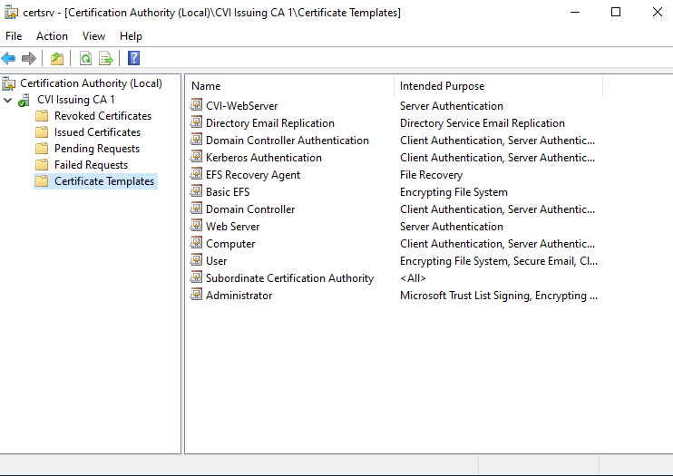

# Lab 02: Issue Your First Certificate from a Custom Template

Lufann Stewart   
May 15, 2026     
**Phase:** 2 | **Week:** 10  
**Submission Path:** `labs/week-10/lab-02-first-issuance.md`

---

## Pre-Lab Verification

Run on PKI-SRV01 before starting.

```powershell
Get-Service -Name CertSvc
certutil -ping
```

**CertSvc status:** Running 
**CA responding (certutil -ping):**
- [X] Yes
- [ ] No — action taken:

**CVI-WebServer template visible in certtmpl.msc (from Lab 01):**
- [X] Yes
- [ ] No — complete Lab 01 before proceeding

---

## Part A — Publish the Template to the CA

The CVI-WebServer template exists in Active Directory but is not yet published to CVI Issuing CA 1. Publishing it makes it available for certificate requests.

**Steps performed on PKI-SRV01:**

1. Opened **certsrv.msc**
2. Expanded **CVI Issuing CA 1** → right-clicked **Certificate Templates** → **New → Certificate Template to Issue**
3. Selected **CVI-WebServer** from the list
4. Clicked **OK**

**CVI-WebServer template now visible under Certificate Templates node:**
- [X] Yes
- [ ] No — describe what happened:

```
No issues _ template is visible.
```

**Screenshot or description of the Certificate Templates node showing CVI-WebServer:**





---

## Part B — Request the Certificate via MMC

**Steps performed on PKI-SRV01, logged in as CORP\pki.admin:**

1. Opened **mmc.exe** → **File → Add/Remove Snap-in**
2. Added **Certificates** snap-in
3. Selected: Computer account (Local Computer)
4. Navigated to **Personal → Certificates**
5. Right-clicked → **All Tasks → Request New Certificate**
6. Proceeded through the Certificate Enrollment wizard

**Certificate Enrollment wizard — enrollment policy selected:**

```
Active Directory Enrollment Policy selected
```

**Templates shown in the wizard:**

```
Computer  
CVI-WebServer  
```

**CVI-WebServer template visible:**
- [X] Yes
- [ ] No — troubleshooting steps taken:

**Subject name entered (if prompted):**

```
No prompt for Subject Name.
```

**Certificate request submitted:**
- [X] Yes — certificate issued immediately
- [ ] Yes — certificate pending manager approval
- [ ] No — error encountered:

```
(paste error here if applicable)
```

---

## Part C — Inspect the Issued Certificate

### In the MMC Certificates Snap-in

Navigate to the Personal → Certificates store and double-click the issued certificate.

**General tab:**

| Field | Value |
|-------|-------|
| Issued to | PKI-SRV01.corp.cvilab.local|
| Issued by |CVI Issuing CA 1 |
| Valid from |5/22/2026 |
| Valid to | 4/25/2027|

**Details tab — record the following fields:**

| Field | Value |
|-------|-------|
| Serial Number |44000000030d20ca71500ba5c4000000000003 |
| Signature Algorithm |sha256RSA|
| Subject |CN = PKI-SRV01.corp.cvilab.local |
| Key Usage | Digital Signature, Key Encipherment (a0)|
| Enhanced Key Usage |Server Authentication (1.3.6.1.5.5.7.3.1) |
| Subject Alternative Name (if present) | Other Name: Principal Name=PKI-SRV01$@corp.cvilab.local DNS Name=PKI-SRV01.corp.cvilab.local|
| Thumbprint |e0046ea8c9d051f976c47ff60246cf3f488ad4f8 |

---

### Via certutil

Export the certificate thumbprint from the Details tab, then run:

```powershell
certutil -store My "<thumbprint>"
```

Replace `<thumbprint>` with the thumbprint value (no spaces).

**Full certutil output:**

```
My "Personal"
================ Certificate 0 ================
Serial Number: 44000000030d20ca71500ba5c4000000000003
Issuer: CN=CVI Issuing CA 1, DC=corp, DC=cvilab, DC=local
 NotBefore: 5/22/2026 5:45 PM
 NotAfter: 4/25/2027 7:36 PM
Subject: CN=PKI-SRV01.corp.cvilab.local
Non-root Certificate
Template: CVI-WebServer
Cert Hash(sha1): e0046ea8c9d051f976c47ff60246cf3f488ad4f8
  Key Container = a547eac941e3a6e7ae8e70257435eee5_f0a99c17-76d3-498a-97de-2992c06105fd
  Simple container name: te-CVI-WebServer-f00259a7-e599-4167-965d-0298e0b61c88
  Provider = Microsoft RSA SChannel Cryptographic Provider
Private key is NOT exportable
Encryption test passed
CertUtil: -store command completed successfully.

```

---

### In certsrv.msc — Issued Certificates Node

Navigate to **certsrv.msc → CVI Issuing CA 1 → Issued Certificates**.

**Does the certificate appear in the Issued Certificates node?**
- [X] Yes

**Record from the Issued Certificates node:**

| Column | Value |
|--------|-------|
| Request ID | 3|
| Requester Name |CORP\PKI-SRV01$ |
| Certificate Template |CVI-WebServer |
| Issued Common Name | PKI-SRV01.corp.cvilab.local|
| Certificate Expiration Date |4/25/2027 7:36 PM |

---

## Part D — Write-Up: The Issuance Workflow

Describe the full certificate issuance workflow in your own words. Cover:

1. What happened in Active Directory when you published the template
2. What the MMC Certificate Enrollment wizard sent to the CA
3. What the CA evaluated before issuing the certificate
4. Where the issued certificate was placed and why

```
When the CVI-WebServer template was published in Active Directory, it became available for enrollment across the domain. To request it, I ran the MMC Certificate Enrollment wizard, which generated a secure private key locally on the server and wrapped the matching public key into a Certificate Signing Request (CSR) to send over the network to the CA. 

The Issuing CA evaluated the request against Active Directory permissions to ensure the server had enrollment rights for the template. Once verified, the CA issued the certificate. The certificate was then automatically placed back into the server's Local Machine Personal Store (Cert:\LocalMachine\My) so secure web applications can access it, and a copy was logged in the Issued Certificates node inside certsrv.msc.
```

**One thing about the issuance process that you did not expect or want to understand better:**

```
I want to better understand how enterprise CA environments are managed remotely, especially how administrators maintain reliable access and control during certificate enrollment and management tasks.
```

---

## Submission Checklist

- [X] Pre-lab verification completed
- [X] Part A: CVI-WebServer template published to CVI Issuing CA 1
- [X] Part A: Template visible in certsrv.msc Certificate Templates node — confirmed
- [X] Part B: Certificate requested via MMC — request submitted
- [X] Part B: Enrollment wizard observations documented
- [X] Part C: Certificate details recorded from MMC (General + Details tabs)
- [X] Part C: certutil -store My output pasted
- [X] Part C: Certificate confirmed in certsrv.msc Issued Certificates node
- [X] Part D: Issuance workflow write-up completed in own words
- [X] File saved as `lab-02-first-issuance.md`
- [X] File committed to portfolio repo under `labs/week-10/`
